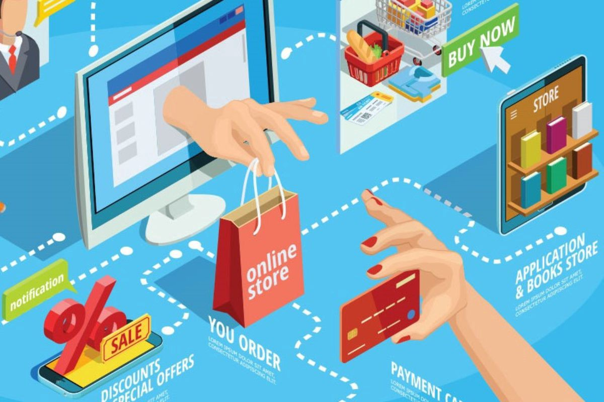

E-commerce Sales Analysis (Power BI)

Overview
This project analyzes e-commerce sales data to uncover insights into category distribution, customer retention, and revenue optimization. The analysis was conducted using Power BI to create dynamic dashboards that support data-driven decision-making.

Objectives

Category Distribution:

Analyze the contribution of each product category to total sales.
Visualize key segments driving revenue (e.g., Clothing, Electronics, Furniture).

Customer Retention:

Evaluate retention trends to identify loyal customers.
Use insights to design strategies that increase repeat purchases.

Revenue Optimization:

Refine marketing strategies by targeting high-value customer segments.
Identify areas to boost profitability through personalized offers.

Key Features

Dynamic Dashboards:

Category-wise sales distribution: Clothing (63%), Electronics (21%), Furniture (17%).
Customer retention trends showing a 20% improvement through targeted offers.
Year-over-year revenue growth insights to refine marketing campaigns.
Actionable Insights:

Personalized discount strategies boosted retention by 20%.
Optimized marketing campaigns increased repeat purchases, enhancing overall profitability.
Power BI Features Used:

Data Transformation: Cleaned and prepared datasets using Power Query.

DAX Measures: Created custom measures for metrics like retention rates and revenue growth.

Visualization: Designed interactive dashboards for stakeholder presentations.

Business Questions Addressed

What product categories contribute most to sales?

How can customer retention be improved using data-driven strategies?

What marketing optimizations can drive repeat purchases?

Analysis:

Explored sales trends and customer behaviors using DAX and Power BI visualizations.
Calculated retention rates and segmented customers based on purchase history.

Visualization:

Created dashboards to highlight key findings and actionable insights.

Key Insights

Category Distribution: Clothing dominated sales with a 63% share, followed by Electronics (21%) and Furniture (17%).

Retention Improvement: Personalized discounts increased customer retention by 20%, contributing significantly to repeat purchases.

Marketing Optimization: Refining targeting strategies for repeat customers resulted in a 10% increase in revenue.
